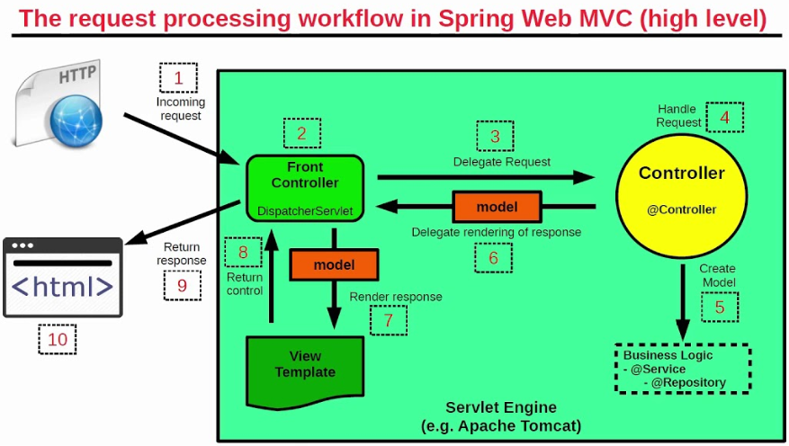
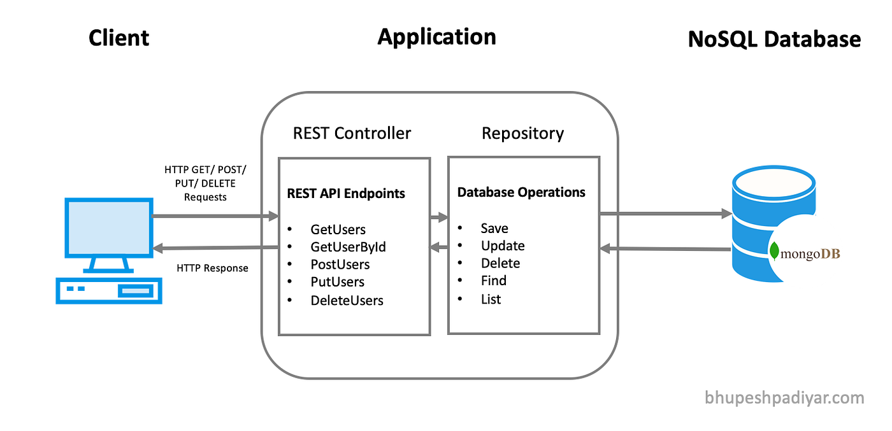

# ¿Que es MVC?
## MVC es un patrón de diseño que contiene tres componentes principales:

- ### Modelo (Model): Gestiona los datos de la aplicación y la lógica de negocio.
- ### Vista (View): Encargada de presentar los datos al usuario.
- ### Controlador (Controller): Procesa las solicitudes del usuario, interactúa con el modelo y selecciona la vista adecuada para renderizar.

### El objetivo de MVC es facilitar el mantenimiento, la escalabilidad y la reutilización del código.

## Arquitectura de Spring MVC
- ### DispatcherServlet: punto de entrada para todas las solicitudes, se encarga de enrutar a los controladores adecuados
- ### Controladores: Manejas las solicitudes y procesan los datos y selecciona la vista adecuada
- ### Modelo: datos y logica de negocio: BEANS y DAO
- ### Vista: interface de usuario como JSP
- ### View resolve: ¿?
- ### handler mapping: mapean las solicitudes a los controladores correctos

## Flujo de trabajo en Spring MVC
- ### El cliente envía una solicitud
- ### DispatcherServlet recibe la solicitud
- ### El controlador procesa la solicitud
- ### El controlador selecciona una vista
- ### El View Resolver localiza la vista
- ### Se genera una respuesta

