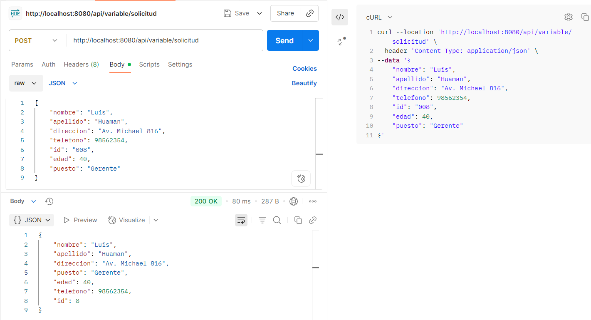
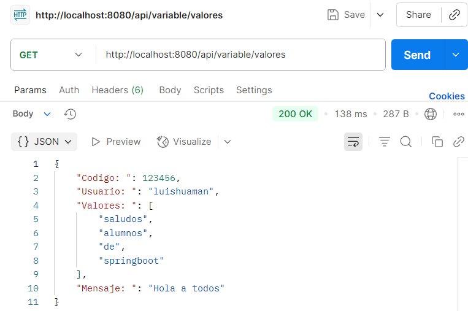

# ¿Que es MVC?
## MVC es un patrón de diseño que contiene tres componentes principales:

- ### Modelo (Model): Gestiona los datos de la aplicación y la lógica de negocio.
- ### Vista (View): Encargada de presentar los datos al usuario.
- ### Controlador (Controller): Procesa las solicitudes del usuario, interactúa con el modelo y selecciona la vista adecuada para renderizar.

### El objetivo de MVC es facilitar el mantenimiento, la escalabilidad y la reutilización del código.

## Arquitectura de Spring MVC
- ### DispatcherServlet: punto de entrada para todas las solicitudes, se encarga de enrutar a los controladores adecuados
- ### Controladores: Manejas las solicitudes y procesan los datos y selecciona la vista adecuada
- ### Modelo: datos y logica de negocio: BEANS y DAO
- ### Vista: interface de usuario como JSP
- ### View resolve: ¿?
- ### handler mapping: mapean las solicitudes a los controladores correctos

## Flujo de trabajo en Spring MVC
- ### El cliente envía una solicitud
- ### DispatcherServlet recibe la solicitud
- ### El controlador procesa la solicitud
- ### El controlador selecciona una vista
- ### El View Resolver localiza la vista
- ### Se genera una respuesta


## DTO (Data Transfer Object)
### Diseñada para transferir datos entre diferentes capas de la aplicacion, por ejemplo controlador y servicio
### DTO tiene como una logica de servicio y el objetivo es comportarse como un contenedor de nuestros datos
### Separacion de preocupaciones o caracteristicas (funcionalidad de spring) como logica de negocio, persistencia de datos, seguridad

# Diferencia entre DTO y Entidad

| Característica | DTO                                        | Entidad |
|----------------|--------------------------------------------|---------|
| **Propósito** | Transferir datos entre capas               | Representar una tabla en la base de datos |
| **Uso** | Interfaz de usuario o API                  | Persistencia en la base de datos |
| **Relaciones** | Normalmente no tienen relaciones complejas | Puede incluir relaciones entre entidades |
| **Framework** | No depende de JPA - JAVA Persistence API   | Generalmente incluye anotaciones de JPA como @Entity |


## @ModelAttribute: anotacion que se usa para manejar datos entre controladores y vistas, especialmente como thymeleaf
## Se usa mucho para renderizar formularios.

## @RequestParam se puede pasar datos importantes, del usuario al controlador, es decir un valor desde la URL

```java
package com.informaticonfig.spring.app.springboot_app.controllers;

import org.springframework.web.bind.annotation.GetMapping;
import org.springframework.web.bind.annotation.RequestMapping;
import org.springframework.web.bind.annotation.RequestParam;
import org.springframework.web.bind.annotation.RestController;

@RestController
@RequestMapping("/api/parametros")
public class RequestParamControllers {

    //Recibe un parametro desde la pagina web que lo retorna
    @GetMapping("/detalle")
    public ParametroDTO detalle(@RequestParam(required = false, defaultValue = "Hola") String informacion) {
        ParametroDTO parametro1 = new ParametroDTO();
        if (informacion != null) { parametro1.setInformacion(informacion); }
        return parametro1;

    }
}
```
- ## http://localhost:8080/api/parametros/detalle?informacion=Como%20estas

    ```json
    {
    "informacion": "Como estas"
    }
    ```
  
## @PathVariable notacion que se utiliza para extraer valores de la URL y asignarlos a variables en un controlador
```java
package com.informaticonfig.spring.app.springboot_app.controllers;

import org.springframework.web.bind.annotation.GetMapping;
import org.springframework.web.bind.annotation.PathVariable;
import org.springframework.web.bind.annotation.RequestMapping;
import org.springframework.web.bind.annotation.RestController;

@RestController
@RequestMapping("/api/variable")
public class PathVariableController {

    @GetMapping("/pagina1/{mensaje}")
    public ParametroDTO pagina1(@PathVariable String mensaje) {

        ParametroDTO parametro1 = new ParametroDTO();
        parametro1.setInformacion(mensaje);
        return parametro1;
    }
}
```

- ## http://localhost:8080/api/variable/pagina1/Hola%20a%20todos

    ```json
    {
    "informacion": "Hola a todos"
  }
    ```

## Se agrego metodo POST y se probo en la herramienta @POSTMAN

```java
    @PostMapping("/solicitud")
    public Empleados crearEmpleados(@RequestBody Empleados empleados1) {
    return empleados1;
}
```
#### Solicitud postman mediante un metodo POST, le pasamos un JSON del modelo Empleados


## @value: se utiliza para inyectar valores en campos, metodos o constructores a partir de una fuente de configuracion
### Como un archivo de propiedades, archivo .yaml o variables de entorno, dinamicamente, propiedad nos sirve para externalizar nuestra configuracion
### Se utiliza el application.properties

#### Controlador PathVariableController.java
```java
package com.informaticonfig.spring.app.springboot_app.controllers;

import com.informaticonfig.spring.app.springboot_app.models.Empleados;
import org.springframework.beans.factory.annotation.Value;
import org.springframework.web.bind.annotation.*;

import java.util.HashMap;
import java.util.Map;

@RestController
@RequestMapping("/api/variable")
public class PathVariableController {

    @Value("${config.usuario}")
    private String usuario;

    @Value("${config.codigo}")
    private int codigo;

    @Value("${config.mensaje}")
    private String mensaje;

    @Value("${config.valores}")
    private String[] valores;
    
    @GetMapping("/valores")
    public Map<String, Object> values() {
        Map<String, Object> json = new HashMap<>();
        json.put("Usuario: ", usuario);
        json.put("Codigo: ", codigo);
        json.put("Mensaje: ", mensaje);
        json.put("Valores: ", valores);

        return json;
    }
}
```

#### aplication.properties
```java
server.port=8080
spring.application.name=springboot-app
config.codigo = 123456
config.usuario = luishuaman
config.mensaje = Hola a todos
config.valores = saludos, alumnos, de, springboot
```
#### Solicitud postman mediante un metodo GET, nos devuelve los datos de config


## Desplegar nuestro JAR : comandos basicos
### Construir nuestro JAR (lo genera en la carpeta target)
- ./mvnw clean package (para consola cmd)
- mvn clean package (para consola IntelliJ idea)

### Levantar nuestro JAR en consola CMD
- java -jar ./target/springboot-app-0.0.1-SNAPSHOT.jar

### Links
- http://localhost:8080/api/detalles_info2
- http://localhost:8080/detalle_info
- http://localhost:8080/api/parametros/detalle?informacion=Como%20estas
- http://localhost:8080/api/variable/pagina1/Hola%20a%20todos